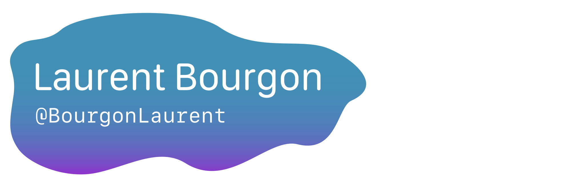

<header>
    
</header>

<footer>
    

    <i>Let's connect and chat! Some days can be quite boring...</i>
        

            
            
            
            
        

    

</footer>

<!--
**BourgonLaurent/BourgonLaurent** is a ✨ _special_ ✨ repository because its `README.md` (this file) appears on your GitHub profile.

Here are some ideas to get you started:

- 🔭 I’m currently working on ...
- 🌱 I’m currently learning ...
- 👯 I’m looking to collaborate on ...
- 🤔 I’m looking for help with ...
- 💬 Ask me about ...
- 📫 How to reach me: ...
- 😄 Pronouns: ...
- ⚡ Fun fact: ...
-->
